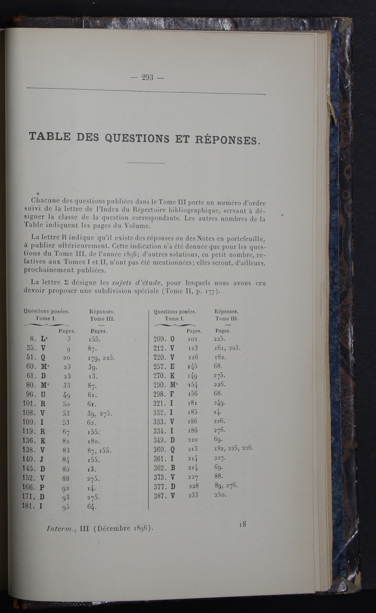
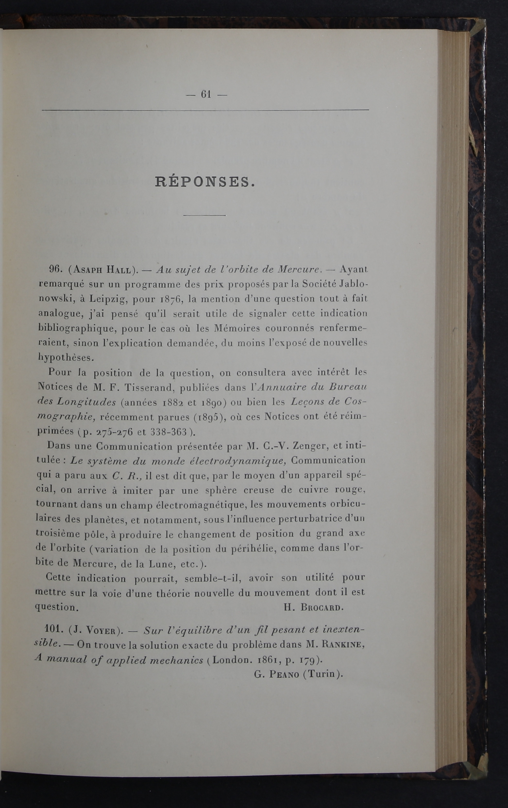

> By : Joël F. / M2 TNAH.

# Indexing nineteenth-century amateur mathematical journals: a TEI (+ODD/RNG) encoding proposal

## 1. Justification

Amateur’ mathematical practices -- i.e. the work of engineers, professors and polytechnicians -- contributed in the 19th century to the structuring of the mathematical discipline, outside the university networks. 

Since the mid-2000s, historians of mathematics have become interested in these collaborative amateur practices. Initial work on these issues, in the absence of access to structured data, was initially carried out at a qualitative level with archival collections. However, some historians who were contemporaries of the first cultural heritage digitisation projects expressed a desire for structured data to guide more quantitative approaches[^1].

### 1.1 Encoding the ‘Intermédiaire des Mathématiciens’ tables and their answers

XML/TEI encoding of first-hand bibliographic material could therefore be useful for synthetically mapping amateur mathematical activity as a whole. This would give researchers access to structured data and allow, for example, statistical approaches with a posteriori computational manipulations:

- to catalogue amateur contributors;

- to list their activities and possibly their preferred mathematical categories;

- to catalogue mathematical questions and answers;

- etc.

> This project could be entirely consistent with the documentary projects of the French network of mathematical libraries and *Numdam*.

**I therefore decided to work on encoding the ‘tables’ from the 1896 ‘Intermédiaire des mathématiciens’ and an example of the answer to which they refer**.

### 1.2 Logic of the tables

These 'tables', which appear at the end of each volume containing twelve of the monthly issues, have been produced each year so that each contribution published can be easily found by consulting the back of the book. These tables are interesting for their relational and referential dimension.

> Sample of a table.

> Sample of a contribution page.

#### 1.2.1 TEI & ODD

The *Intermediaire des mathématiciens* encoding is based on TEI. However, some modifications and additions, by an ODD file, are been realised. 

> See : tei_intermediaire_oddgenereted.odd, from line 470; or the [documentation in HTML](tei_intermediaire_oddgenerated.html).

Additions and modifications can be found on the odd file and in the documentation, but I will explain some important tags here.

##### An addition : the "contribution" tag

I've created the `<contribution>` tag for indicate any question or answer with an `@ref` attribute (datatype : integer). I've use `<attDef>`.

> See : [tei_intermediaire_oddgenerated.html#TEI.contribution](tei_intermediaire_oddgenerated.html#TEI.contribution)

##### An addition : the "resolvedBy" tag

I've also created the `<resolvedBy>` tag for specify who has formuled a responses to a scientific problem. He contains a `<sequence>`:  `<persName>` and a `<from>` tag (created also for the occasion). We can indicate when the name's contributor is an alias or note with `@pseudo` (true or false).

> See : [tei_intermediaire_oddgenerated.html#TEI.resolvedBy](tei_intermediaire_oddgenerated.html#TEI.resolvedBy)

##### An addition : the "topic" tag

I needed the `<topic>` element with a restrain reference. This tag indicates the topic of the contribution : mathematics, astronomy, physics, etc.

> See : [tei_intermediaire_oddgenerated.html#TEI.topic](tei_intermediaire_oddgenerated.html#TEI.topic)

##### A modification : the "div" tag

The `
` has been modified: I needed an `@section` attribute for different parts of the book (table, questions, responses, table_authors).

> See : [tei_intermediaire_oddgenerated.html#TEI.div](tei_intermediaire_oddgenerated.html#TEI.div)

---

## 2. Facultative bibliography

### 2.1 History of mathematics

- Pauline Romera-Lebret, *La nouvelle géométrie du triangle : passage d'une mathématique d'amateurs à une mathématique d'enseignants (1873-1929)*, Thèse de doctorat en histoire des mathématiques sous la direction d'Evelyne Barbin, Nantes, Université de Nantes, 2009.

- Hélène Gispert, *La France mathématique de la IIIe République avant la Grande Guerre*, Paris, éd. de la Société Mathématique de France, 2015.

- Norbet Verdier et Christian Gerini, *L'émergence de la presse mathématique en Europe au 19ème siècle*, Londres, College Publications, 2014.

### 2.2 TEI ressources

Here are the documents that helped/inspired me write my DTD (non-exaustive list):

- [2 The TEI Header - The TEI Guidelines](https://tei-c.org/release/doc/tei-p5-doc/fr/html/HD.html#HD11)

- [16 Language Corpora - The TEI Guidelines](https://tei-c.org/release/doc/tei-p5-doc/en/html/CC.html#CCDEF)

- [24 Using the TEI - The TEI Guidelines](https://tei-c.org/release/doc/tei-p5-doc/it/html/USE.html#MDMDCM)

- https://books.openedition.org/oep/688

- [Manuel d'encodage TEI Renaissance et temps modernes](http://www.bvh.univ-tours.fr/XML-TEI/ManuelWeb/Manuel_TEI_BVH.html)

[^1]: [Les journaux de mathématiques dans la première moitié du xixe siècle en Europe](https://journals.openedition.org/philosophiascientiae/297#bodyftn32)
